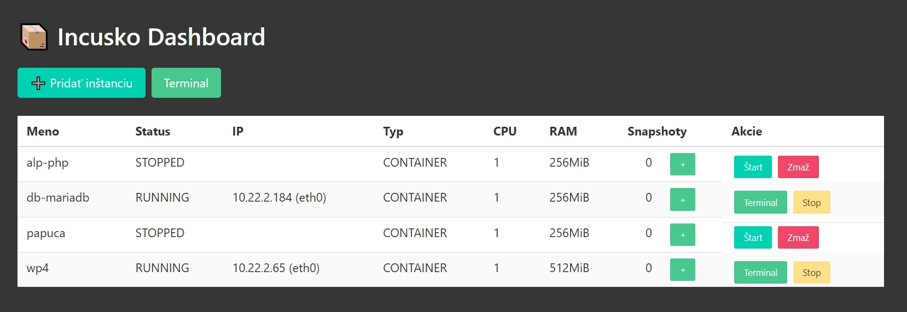

# 🚀 INCUSKO – Kontajnerový projekt

**Incusko** je minimalistický kontajnerový systém postavený na filozofii jednoduchej správy a maximálneho výkonu. Využíva technológie od [LinuxContainers](https://github.com/linuxcontainers) a inšpiruje sa nástrojmi ako LXD, systemd-nspawn a Podman.

> 🧪 Projekt je určený na experimentovanie s moderným virtualizačným prístupom bez potreby kompletných hypervízorov.

---

## 🖼️ Ukážka



---

## 📚 Zdroje & Odkazy

- 📘 [Oficiálna LXD dokumentácia](https://linuxcontainers.org/lxd/introduction/)
- 🧱 [Incus – ľahký nástupca LXD](https://github.com/lxc/incus)
- 🔐 [VPN Wireguard Router](https://github.com/linuxcontainers/vpn-wireguard-router)

---

## 🧰 Použité technológie

- `ttyd` – Webový terminál ako rozhranie pre správu
- `mini_httpd` – Ľahký embedded web server
- `systemd` – Init & service manager
- `bash` – Automatizačné skripty

---

## 📦 Inštalácia

```bash
wget -O ttyd https://github.com/tsl0922/ttyd/releases/latest/download/ttyd.x86_64
chmod +x ttyd
sudo mv ttyd /usr/local/sbin/ttyd

